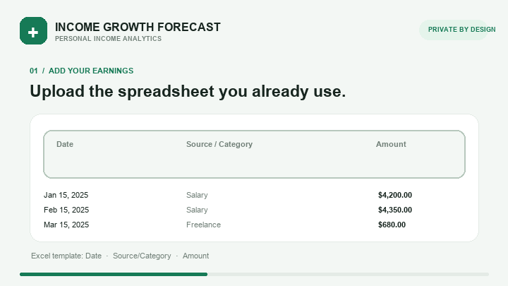
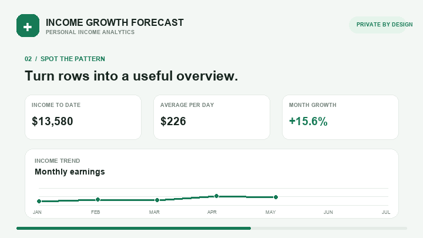
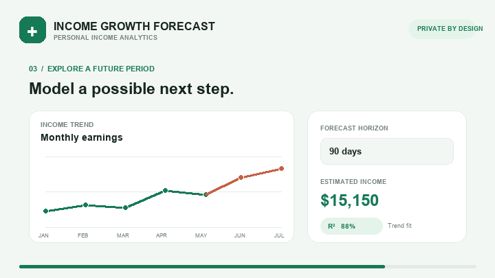

<p align="center">
	
</p>

# Income Growth Forecast

A responsive, spreadsheet-first income analytics website. Upload a personal income workbook to understand earnings history, compare growth, and explore a simple trend-based forecast. It runs entirely in the browser; there is no application backend.

> **Demo data only:** the preview images and template use fictional sample amounts. Forecasts are estimates for exploration, not promises or financial advice.

## Preview

The animated product walkthrough is [here](assets/income-growth-forecast-promo.gif). Individual screens:

| Upload your workbook | Review the income dashboard | Explore a forecast |
| --- | --- | --- |
|  |  |  |

## User workflow

1. Open the website and select **Excel template** to download the example `.xlsx` workbook.
2. Replace the sample rows with your own transactions, keeping the three required headers.
3. Drop the completed `.xlsx`, `.xls`, or `.csv` file into the upload area, or browse to it. The first worksheet is read in the browser.
4. Review total income, average daily income, month-over-month change, overall month growth, and the trend-fit score.
5. Choose a number of days, weeks, or months in the forecast controls. The estimated total and graph update immediately.
6. Hover over graph points to inspect the exact monthly amount. Use **Clear data** before uploading another file.

## Spreadsheet format

The first row of the first worksheet must contain these columns (column order can vary):

| Date | Source/Category | Amount |
| --- | --- | ---: |
| 2025-01-15 | Salary | 4200 |
| 2025-02-15 | Freelance | 650 |

Accepted header alternatives include `Source`, `Category`, `Income`, and `Earnings`. Dates should be valid spreadsheet dates or recognizable date strings; amounts should be non-negative numeric income values. At least two valid entries in two different calendar months are required. Invalid rows are skipped and reported.

## What the dashboard calculates

- **Total income to date:** sum of all valid uploaded transaction amounts.
- **Average per day:** total income divided by the inclusive number of calendar days between the first and last transaction dates.
- **Month-over-month growth:** $100 \times (L - P) / P$, where $L$ is the latest recorded calendar month's income and $P$ is the preceding calendar month's income. It is shown as unavailable if there is no previous-month baseline.
- **Overall income growth:** percentage difference between the first and latest recorded calendar month totals.
- **R-squared ($R^2$):** the in-sample fraction of monthly income variation explained by the fitted line. A higher score indicates a closer historical fit, not a probability of being right in the future.

## Forecast theory

Transactions are first grouped into calendar-month totals. Missing months within the history are represented as zero so gaps remain visible to the model. Ordinary least squares fits a straight line to the monthly sequence:

$$\hat{y}_m = a + b m$$

Here, $m$ is the month index, $a$ is the fitted starting level, and $b$ is the average monthly trend. For each day in the requested future period, the app estimates that calendar month's income from the line and prorates it by the number of days in that month. It adds those daily shares to produce the projected income for the selected period. Negative monthly predictions are floored at zero.

The line does not model seasonality, inflation, changing employment, one-time bonuses, or uncertainty intervals. A small or irregular history can produce a poor fit; use the result as a simple planning scenario, not a guarantee. R-squared is a goodness-of-fit statistic and is not the probability that the forecast will occur.

## Privacy and security

Spreadsheet parsing and calculations run on the user's device; the workbook is not sent to an app server. This static app loads its interface and libraries (Tailwind CSS, Chart.js, SheetJS, and Lucide) from public CDNs, so an internet connection is needed and the browser contacts those CDN providers. For sensitive financial workbooks, prefer trusted devices and networks. The site does not save uploaded workbook data after the page is closed or refreshed.

## Run locally

Requirements: Python 3 and an internet connection for the CDN libraries. No Node install, package manager, or Python dependencies are required.

Open a terminal in this project folder:

```powershell
py -m http.server 8010
```

Open [http://localhost:8010](http://localhost:8010). To stop the local server, focus the terminal and press `Ctrl+C`.

## Technology and code map

- `index.html` contains the responsive interface, styles, upload validation, in-browser calculations, chart setup, theme toggle, and Excel template generator.
- `Chart.js` draws the interactive monthly history and forecast chart; tooltips format exact amounts as USD.
- `SheetJS` reads `.xlsx`, `.xls`, and `.csv` content locally and creates the downloadable `.xlsx` template.
- Tailwind CSS supplies responsive layout utilities; a small custom stylesheet defines the light/dark design tokens and interaction states.
- `income-history-template.csv` is a spreadsheet-compatible example. The app's **Excel template** button generates the requested `.xlsx` workbook.
- `make_promo_gif.py` creates the animated product walkthrough and the preview/poster images using Pillow.

## GitHub Pages deployment

The included `.github/workflows/pages.yml` workflow publishes this static site whenever a commit is pushed to `main`. For the first deployment, open the repository's **Settings → Pages**, set the build/deployment source to **GitHub Actions**, and save. Push to `main`; the Actions tab will show deployment progress and the Pages URL when it finishes. The interactive site needs a public HTTPS URL; `localhost` only works on the developer's machine.

## License and data

No real user data is included. Replace the sample workbook rows with your own data only in your local browser session. Choose and add a license before accepting external contributions or redistributing the project.
